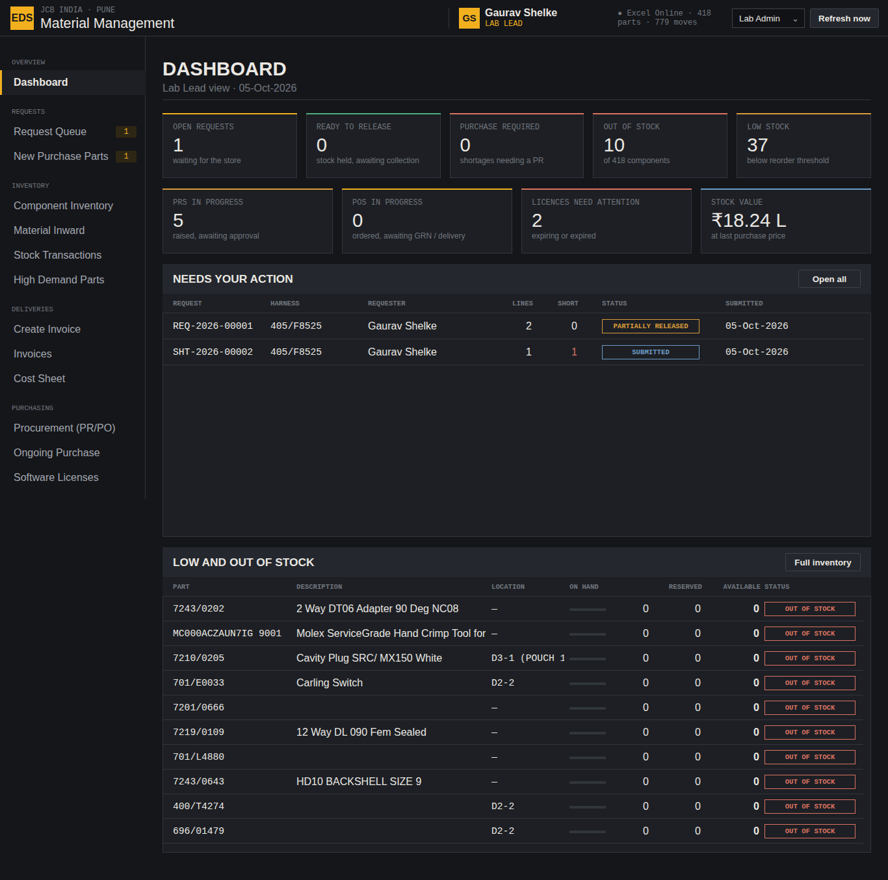

# JCB EDS Lab Material Portal — Power Apps version

Your v8 HTA portal rebuilt as a **Power Apps canvas app**, with the same screens, the same dark/JCB-yellow
look, the same Excel tables and the same business rules. You need only what your company already has:
**Microsoft 365 + Power Apps + OneDrive/SharePoint**. You don't install anything and you don't use Python.



## What's in this folder

| Path | What it is | You use it for |
|---|---|---|
| `excel/EDS-Lab-Data-PowerApps.xlsx` | Your workbook, ready for OneDrive (adds an `Email` column and typed `SAMPLE` rows) | Step 1 (both routes) |
| `app/EDS-Lab-Portal.msapp` | The whole app (23 screens) as one file | **Route A**: open it, connect Excel, done |
| `paste/` | The same app as text: 3 app formulas + 23 screen files | **Route B**: paste screen by screen |
| `docs/` | Step-by-step guides, test checklist, troubleshooting, previews | Read in order |
| `hta-fix/` | Optional one-line fix for a shortfall bug I found in the HTA v8 | Only if you keep using the HTA |
| `tools/` | The generator and the verification harness I used to check everything | You don't need these at work |

## Do this, in this order

1. **[docs/01-Excel-setup.md](docs/01-Excel-setup.md)**: upload the workbook to OneDrive or SharePoint (10 min).
2. **[docs/02-Route-A-open-msapp.md](docs/02-Route-A-open-msapp.md)**: open the `.msapp`, connect the Excel file, save (15 min).
   *If Studio refuses the file*, use **[docs/03-Route-B-paste-screens.md](docs/03-Route-B-paste-screens.md)** instead (about 1–2 hours, mostly copy/paste).
3. **[docs/04-Test-checklist.md](docs/04-Test-checklist.md)**: 20-minute click-through that proves the important rules on your tenant.
4. Stuck? **[docs/05-Troubleshooting.md](docs/05-Troubleshooting.md)**. Want to know what differs from the HTA or the Copilot prompt?
   **[docs/06-Differences-and-HTA-bug.md](docs/06-Differences-and-HTA-bug.md)**. Changing things later?
   **[docs/07-How-it-works.md](docs/07-How-it-works.md)** and **[docs/08-Copilot-prompt-corrected.md](docs/08-Copilot-prompt-corrected.md)**.

## Screens (same names and grouping as the HTA)

| Engineer | Lab Admin / Lab Lead | Manager |
|---|---|---|
| Dashboard, Check Stock, BOM Compare, NEW REQUEST, My Requests, Brand New Purchase Part | Dashboard, Request Queue (+ request detail with Reserve / RELEASE / Request separately), New Purchase Parts, Component Inventory, Material Inward, Stock Transactions, High Demand Parts, Create Invoice, Invoices, Cost Sheet (+ print), Procurement (PR/PO), Ongoing Purchase, Software Licenses, Check Stock, BOM Compare, Team access | Manager Dashboard (revenue pie, PR/PO bars, deliveries, projects, calibration), All Requests, Invoices, Procurement, Ongoing Purchase, High Demand Parts, Software Licenses, Inventory, all read-only |

Previews of every screen, rendered from the generated app with your real data, are in [`docs/preview/`](docs/preview).

## How I checked it, and how far you can trust it

I don't have access to your Microsoft 365 tenant, so I couldn't open the app in Power Apps Studio myself.
Instead I ran every check I could from outside, using Microsoft's own tools and libraries:

| Check | Tool | Result |
|---|---|---|
| Every screen file matches Microsoft's pa.yaml v3 schema | `pa.schema.yaml` from microsoft/PowerApps-Tooling | 25/25 files valid |
| Microsoft's own source deserializer accepts every file (the one `pac` uses) | `PaYamlSerializer` from the Power Platform CLI | 48/48 files (25 source + 23 paste) |
| `.msapp` built by Microsoft's packer, then unpacked again | `pac canvas pack/unpack` 2.12.2 | packs; round trip byte-identical |
| Every formula is valid Power Fx syntax | Microsoft.PowerFx engine 1.8.1 | 29,130 formulas, 0 errors |
| Every formula **type-checks** against your workbook's real columns (names, types, control references) | Microsoft.PowerFx engine + your tables | 29,041 property formulas, 0 errors |
| The real button formulas, run on your real data | Power Fx engine (workflow simulation) | **79/79 checks pass** (list in docs/04) |
| Screen layout (no overlaps or clipping) | my renderer + Chromium screenshots | 23 screens reviewed, issues fixed |

What those checks prove: the logic is right. Stock always equals the movement sum for all 418 parts.
The manager's 50-asked / 40-available case reserves 40, releases 40, keeps the 10 shortfall visible,
routes it to Ongoing Purchase, and splits it into its own request. The Finance formula gives ₹16,808.15
at 100 circuits and ₹33,616.30 at 200. Invoice numbers come out as `IDC EDS/26-27/001`, and so on.

What they can't prove, because only Power Apps Studio on your tenant can:
- whether Studio opens the `.msapp`. Packing from YAML is a **preview** feature of `pac`, so I give you Route B as a guaranteed fallback.
- how the Excel connector types each column and how fast it is on your network
- whether every classic-control property name I used is accepted. I stuck to the standard, well-known ones and left out control versions, which Microsoft's docs say makes Studio use the latest version.
- exact fonts and pixels, printing (`Print()`), and the OneDrive photo upload

**My honest score: 8.5 / 10.** It isn't 10 because of the first-open risks listed above, not because of
the logic. The fastest route to 10: open it once. If Studio shows any error, copy the error text (or take
a screenshot of the App checker list) and paste it back to me; the generator fixes all 23 screens in one go.

### Rebuild / re-verify (only if you have a machine with Python + .NET, not needed at work)
```bash
python3 tools/build.py                 # regenerate app/Src and paste/
python3 tools/make_msapp.py            # pack app/EDS-Lab-Portal.msapp (needs pac)
tools/verify/run_all.sh                # every check above
```
