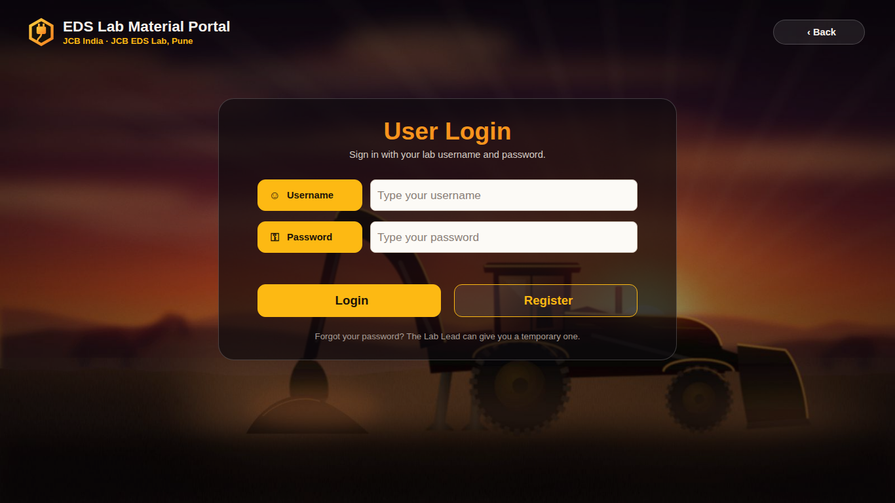

# JCB EDS Lab Material Portal — Power Apps version (v2)

Your v8 HTA portal rebuilt as a **Power Apps canvas app**: the same Excel tables and business rules, now with
a username + password login, approvals for Lab Admin and Manager, live stock that refreshes itself, and a
dark-glass / gold-orange look over a backhoe-loader sunset. You need only what your company already has:
**Microsoft 365 + Power Apps + OneDrive/SharePoint**. You don't install anything and you don't use Python.



**New in v2:** see **[docs/09-v2-whats-new.md](docs/09-v2-whats-new.md)**. It covers every point from your list:
- login and Register
- the cursor and invisible-text fixes
- real-time stock and Data Health
- the New Part form
- Title Case
- photos
- approvals

## What's in this folder

| Path | What it is | You use it for |
|---|---|---|
| `excel/EDS-Lab-Data-PowerApps.xlsx` | Your workbook, ready for OneDrive (Email column, typed `SAMPLE` rows, Data Health rows in Settings) | Step 1 (both routes) |
| `app/EDS-Lab-Portal.msapp` | The whole app (25 screens) as one file | **Route A**: open it, connect Excel, done |
| `paste/` | The same app as text: 3 app formulas + 25 screen files | **Route B**: paste screen by screen |
| `app/media/bg-backhoe.jpg` | The background picture (already inside the app) | Only if you want to swap in your own photo |
| `docs/` | Step-by-step guides, test checklist, troubleshooting, previews | Read in order |
| `hta-fix/` | Optional one-line fix for a shortfall bug I found in the HTA v8 | Only if you keep using the HTA |
| `tools/` | The generator and the verification harness I used to check everything | You don't need these at work |

## Do this, in this order

1. **[docs/01-Excel-setup.md](docs/01-Excel-setup.md)**: upload the workbook to OneDrive or SharePoint (10 min).
2. **[docs/02-Route-A-open-msapp.md](docs/02-Route-A-open-msapp.md)**: open the `.msapp`, connect the Excel file, save (15 min).
   *If Studio refuses the file*, use **[docs/03-Route-B-paste-screens.md](docs/03-Route-B-paste-screens.md)** instead (about 1–2 hours, mostly copy/paste).
3. **[docs/04-Test-checklist.md](docs/04-Test-checklist.md)**: 25-minute click-through that proves the important rules on your tenant.
4. Stuck? **[docs/05-Troubleshooting.md](docs/05-Troubleshooting.md)**. Want to know what differs from the HTA or the Copilot prompt?
   **[docs/06-Differences-and-HTA-bug.md](docs/06-Differences-and-HTA-bug.md)**. Changing things later?
   **[docs/07-How-it-works.md](docs/07-How-it-works.md)** and **[docs/08-Copilot-prompt-corrected.md](docs/08-Copilot-prompt-corrected.md)**.

## Screens

| Everyone | Engineer | Lab Admin / Lab Lead | Manager |
|---|---|---|---|
| Welcome, User Login (Login, Register, Set Your Password), About | Dashboard, Check Stock, BOM Compare, New Request, My Requests, Brand New Purchase Part | Dashboard, Request Queue (+ request detail: Approve / Reject / Reserve / Release / Request Separately), New Purchase Parts, Component Inventory, Material Inward, Stock Transactions, High Demand Parts, Create Invoice, Invoices, Cost Sheet (+ print), Procurement (PR/PO), Ongoing Purchase, Software Licenses, Team Access (approve access, roles, temporary passwords), Data Health, plus all Engineer screens | Dashboard with *Waiting for Your Approval*, All Requests (Approve / Reject), New Purchase Parts (Approve / Reject), Procurement (Approve PR), Invoices, Ongoing Purchase, High Demand Parts, Software Licenses, Inventory, plus all Engineer screens |

Previews of every screen, rendered from the generated app with your real data, are in [`docs/preview/`](docs/preview).

## How I checked it, and how far you can trust it

I don't have access to your Microsoft 365 tenant, so I couldn't open the app in Power Apps Studio myself.
Instead I ran every check I could from outside, using Microsoft's own tools and libraries:

| Check | Tool | Result |
|---|---|---|
| Every screen file matches Microsoft's pa.yaml v3 schema | `pa.schema.yaml` from microsoft/PowerApps-Tooling | 27/27 files valid |
| Microsoft's own source deserializer accepts every file (the one `pac` uses) | `PaYamlSerializer` from the Power Platform CLI | 52/52 files (27 source + 25 paste) |
| `.msapp` built by Microsoft's packer, then unpacked again | `pac canvas pack/unpack` 2.12.2 | packs; round trip byte-identical |
| Every property name exists on that control (checked against the official control templates embedded in Microsoft's sample apps) | template manifests from microsoft/PowerApps-Tooling | 35,770 properties, 0 problems (only the single *Add picture* control couldn't be checked) |
| Every formula is valid Power Fx syntax | Microsoft.PowerFx engine 1.8.1 | 35,885 formulas, 0 errors |
| Every formula **type-checks** against your workbook's real columns (names, types, control references) | Microsoft.PowerFx engine + your tables | 35,781 property formulas, 0 errors |
| The real button formulas, run on your real data (incl. every login path) | Power Fx engine (workflow simulation) | **108/108 checks pass** (list in docs/04) |
| Every button, input and menu item pressed once | Power Fx engine (smoke test) | **188 pressed, 0 runtime errors** |
| Screen layout, casing, wording | my renderer + Chromium screenshots | 25 screens + 2 login states reviewed, issues fixed |

What those checks prove: the logic is right. Stock always equals the movement sum for all 418 parts.
The manager's 50-asked / 40-available case reserves 40, releases 40, keeps the 10 shortfall visible,
routes it to Ongoing Purchase, and splits it into its own request. The Finance formula gives ₹16,808.15
at 100 circuits and ₹33,616.30 at 200. Invoice numbers come out as `IDC EDS/26-27/001`, and so on.

What they can't prove, because only Power Apps Studio on your tenant can:
- v1 opened in your Studio (after the PA2108 fix), so the packing route and the control type names work. New in v2 and
  not yet seen in your Studio: `OnChange` on the *Add picture* box (the one property no Microsoft template could
  confirm), the 75 KB background picture stored inside App.Formulas, and password-mode text boxes.
- how the Excel connector types each column and how fast it is on your network (About → Data Health shows it)
- exact fonts and pixels, printing (`Print()`), and the OneDrive photo upload (About → Photo Storage Check tests it)

**My honest score: 8.5 / 10.** The logic, login and every button pass in Microsoft's engine. The missing points
are the first-open items above. If Studio shows any error, paste me the text (or a screenshot of the App checker)
and the generator fixes all 25 screens in one go.

### Rebuild / re-verify (only if you have a machine with Python + .NET, not needed at work)
```bash
python3 tools/build.py                 # regenerate app/Src and paste/
python3 tools/make_msapp.py            # pack app/EDS-Lab-Portal.msapp (needs pac)
tools/verify/run_all.sh                # every check above
```
